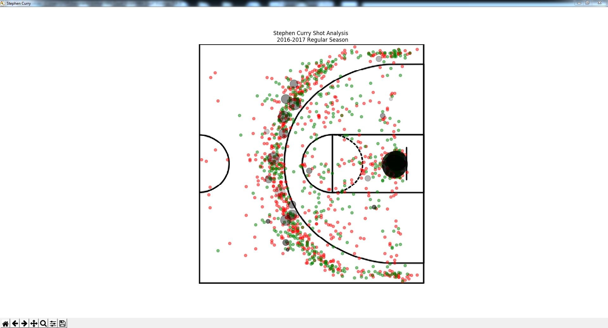
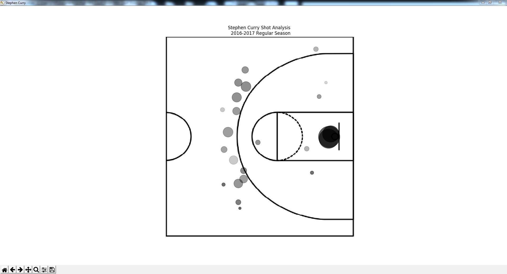
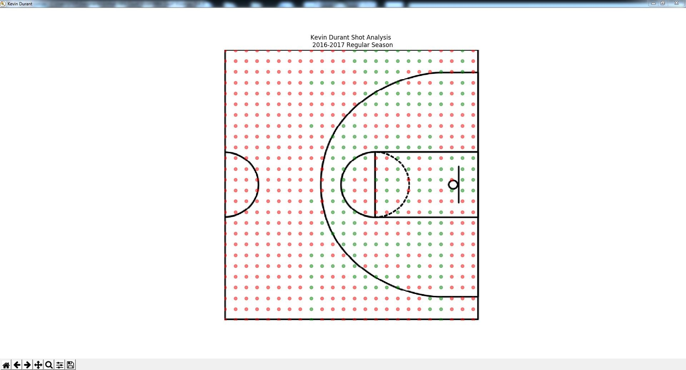
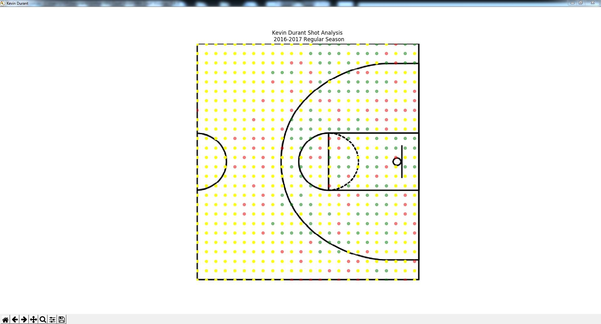

# NBA Court Vision

As Fall 2017 Exam Season reaches its climax, I did what any other university student would do - make a side project! I'm a huge basketball fan. From any NBA match, you can tell that many basketball players have a unique style of play. We have players like Stephen Curry and Kyrie Irving dominating the 3-point range or like LeBron James and Russell Westbrook who devastate their opponents near the rim. 

But avid NBA fans know these characteristics out of instinct after watching the NBA for weeks, months, maybe even years. I wanted to find a concrete method of arriving at these conclusions. This led me to create a Python program which analyzes any current NBA player's gameplay to find which areas of the court they have most shooting success and the probability of shooting from certain spots. With this analysis, it can allow coaches and players to know their opponents gameplay and can show them which areas of the court to prioritize their defense.

## How It Works

Using datasets from Kaggle (formatted with Pandas), we can use Matplotlib to illustrate our data analysis. This dataset includes every shot taken in the 2016-2017 Regular Season so any player who played a game during this season can be analyzed. By incorporating machine learning through Python's Scikit-Learn (using a Decision Tree Classifier) we can also simulate a player's shooting from every position on the court. 

I incorporated multiple methods of analyzing shooting habits so let's take a look!

## Stephen Curry Shooting Analysis

Let's start off with the two time MVP from the Golden State Warriors, Stephen Curry. In this plot, the green dots represent scoring shots while the red dots represent missed shots. The black dots represent spots that Curry is most likely to shoot from. The size of the dots represent the relative probability of Curry shooting from that position and the darkness of the dot illustrates his shot accuracy from that spot (with darker shades representing a higher accuracy).

However, the black dots are a bit hard to see because of the green and red dots, so let's simplify the plot.

## Kevin Durant Shooting Analysis

